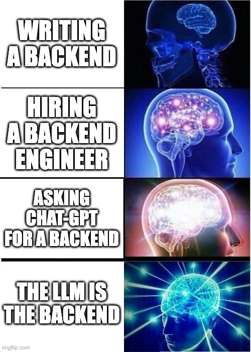

# GPT is all you need for the backend

People have been saying Github Copilot will replace programmers. We think that's wrong. We have all-powerful models and we want to restrict them to writing code? All code has bugs!

Code is not the ideal way to encode business logic. Code must be reviewed, and it does what you tell it, not what you want. The proper format for business logic is human intelligence.

So we thought, who needs python and ec2s and biz logic and postgres?

We've built an entire Backend+Database powered by an LLM. It infers business logic based on the name of the API call and can persist a kilobyte of state!

Here's the experience of the future:
1. Instruct the LLM on the purpose of the backend (i.e. "This is a todo list app")
2. Write the initial json blob for the database state (i.e. {todo_items: [{title: "eat breakfast", completed: true}, {title: "go to school", completed: false}]}
3. Start making API calls! You now have infinite backend endpoints that will infer their own business logic and update the persistent state!

## Why
This is the future we imagine
1. You can iterate on your frontend without knowing exactly what the backend needs to look like.
2. Backend gives you the wrong format? `https://backend-gpt.com/chess/get_board_state()` -> `https://backend-gpt.com/chess/get_board_state_as_fen()`
3. Mistype an API name? It doesn't matter!
4. Serverless w/o the cold start: The only difference between your server and someone elses is the 1KB of state and the LLM instructions, these can be swapped out in milliseconds

## Still don't get it?
Here's how it works in Parker's words

We basically used GPT to handle all the backend logic for a todo-list app. We represented the state of the app as a json with some prepopulated entries which helped define the schema. Then we pass the prompt, the current state, and some user-inputted instruction/API call in and extract a response to the client + the new state. So the idea is that instead of writing backend routes, the LLM can handle all the basic CRUD logic for a simple app so instead of writing specific routes, you can input commands like add_five_housework_todos() or delete_last_two_todos() or sort_todos_alphabetically() . It tends to work better when the commands are expressed as functions/pseudo function calls but natural language instructions like delete last todos also work.
